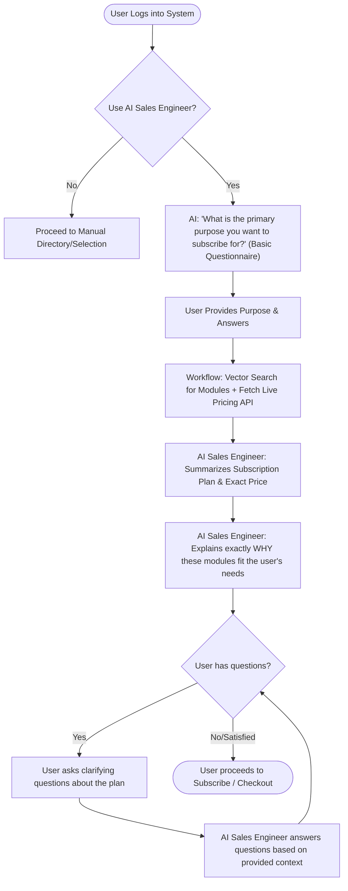

# Requirement Document: Product Recommendation & Pricing RAG System

## 1. Executive Summary
The objective is to build an intelligent Retrieval-Augmented Generation (RAG) system that acts as a **personalized Sales Engineer**. It will analyze a user's business needs, recommend the appropriate software/service modules, and provide estimated pricing via text or voice chat. The goal is to give users a clear, tailored proposal that details *why* a module fits their exact needs, ultimately guiding them toward subscription.

The system will leverage **n8n** for orchestration and entirely open-source, commercially viable LLMs and embedding models to ensure data privacy and avoid ongoing API token costs.

---

## 2. Core Workflow Design

1. **User Inquiry**: The user inputs their requirements via a chat interface or a structured web form.
2. **Context Retrieval & Dynamic Pricing**: 
   - The user query is converted into an embedding.
   - The system queries the Vector Database to fetch the most relevant modules for the user's problem.
   - **Crucial Step**: The workflow calls an internal **Pricing/Subscription API** that queries your live PostgreSQL database to fetch the exact, up-to-date prices and rules for those specific modules.
3. **Generation**: An LLM synthesizes the user's needs, the retrieved module descriptions, and the live API pricing data.
4. **Advisory Output**: The system returns a structured response including:
   - Acknowledgment of the user's problem.
   - Recommended modules, including a detailed explanation of *why* each module solves their specific problems (acting precisely as a personalized Sales Engineer would).
   - Breakdown of pricing/subscription costs based on the modules.
   - A clear Call to Action (CTA) to subscribe.

### 2.1. User Interaction Flow Diagram

---

## 3. Technology Stack Recommendations

### 3.1. Orchestration: n8n
**Concept**: n8n is an excellent choice for AI workflows due to its native "Advanced AI" LangChain nodes. It allows you to visually build and debug RAG pipelines without heavy coding.
* **Ingestion Pipeline**: Create an n8n workflow that reads your module documentation, chunks the text, and writes to a Vector Database.
* **Retrieval Pipeline**: Create a webhook-triggered n8n workflow that handles user queries, interacts with the Vector Database, and queries the LLM.
* **Integration**: Easily connect the final output to CRM platforms, email, or a frontend web app.

### 3.2. Hosting Inference: Ollama or vLLM
Since you want open-source commercial models, the best approach is to self-host them.
* **Ollama**: Extremely easy to set up via Docker. It integrates directly with n8n's "Ollama Model" nodes. Standard choice for 7B-14B parameter models.
* **vLLM**: If you expect high concurrency (many users at once), vLLM offers much higher throughput. n8n can connect to vLLM via the standard "OpenAI-compatible HTTP" node.

### 3.3. LLMs (Open-Source & Commercially Viable)
You must select models with an **Apache 2.0**, **MIT**, or permissive commercial license.
* **Llama 3.1 (8B)**: 
  * *License*: Llama 3 Commercial License (Free for <700M monthly active users).
  * *Pros*: Arguably the best in its size class. Excellent at reasoning, following formatting instructions, and preventing hallucinations in RAG.
* **Qwen 2.5 (7B or 14B)**:
  * *License*: Apache 2.0.
  * *Pros*: Highly optimized, exceptional context understanding, and truly open-source.
* **Mistral-Nemo-Instruct (12B)**:
  * *License*: Apache 2.0.
  * *Pros*: Large context window (128k), co-developed by Mistral and Nvidia. Excellent for reading large chunks of retrieved module documentation.

### 3.4. Embedding Models (Open-Source)
Embedding models turn your module descriptions into vectors for search. It is critical that these are also commercially viable.
* **nomic-embed-text**: (Apache 2.0). Extremely efficient, 8k context length, runs easily in Ollama.
* **bge-m3 / bge-large-en-v1.5**: (MIT). Top-tier open-source retrieval models.

### 3.5. Vector Database: PostgreSQL (pgvector)
* **Rationale**: Since you already have a PostgreSQL database in your stack, the most efficient and robust approach is to use the **`pgvector`** extension.
* **Benefits**: 
  - **No New Infrastructure**: You don't need to spin up and maintain a separate vector database like Qdrant or Milvus. 
  - **Data Consolidation**: User profiles, subscription logic, and your high-dimensional document vectors all live in one seamless system.
  - **n8n Native Integration**: n8n has native Postgres vector store capabilities (via LangChain), making it highly compatible for building your RAG pipelines.

---

## 4. Addressing Common Pitfalls (Our Strategy)

1. **Hallucinating Prices**: LLMs are known to invent numbers. 
   - *Solution*: Pass strict system prompts: *"You are a sales advisor. ONLY use the pricing provided in the context. Do not estimate or invent prices. If the pricing requires a custom quote, say 'Please contact sales'."*
2. **Outdated Knowledge**: If module prices change, the LLM might still suggest old prices.
   - *Solution*: Re-trigger your n8n ingestion workflow automatically whenever your base pricing or module documentation is updated.
3. **Complex Calculations & Sync Issues**: If a price changes in your database, you don't want the LLM quoting outdated prices. Furthermore, LLMs often struggle with math (e.g., "$10 per month x 42 users").
   - *Solution*: Rely completely on the **Pricing/Subscription API**. The n8n workflow will extract the user's parameters (e.g., "42 employees", "need payroll"), send them to this API, and the API will calculate and return the precise numeric price directly from your live database. The LLM will then be instructed *only* to communicate that exact number to the user, completely eliminating math hallucinations.

---

## 5. Next Steps / Action Items
1. **Document Modules**: Draft clean, structured Markdown or JSON documents detailing every module, its features, and precise pricing rules. Let me know when you have a sample, and I can help structure it for optimal vector retrieval.
2. **Infrastructure Prep**: 
   - Ensure your existing PostgreSQL database has the `pgvector` extension enabled (`CREATE EXTENSION vector;`).
   - Provision a server with a decent GPU to run Ollama and n8n.
3. **Define Persona**: Program the system to strictly behave like a **personalized Sales Engineer**. Determine the tone (e.g., highly professional, consultative, enthusiastic) for both text-based web chats and potential voice interactions.

*Please review these concepts and provide any feedback or specific module structures you have built out, and we can iterate this document!*
